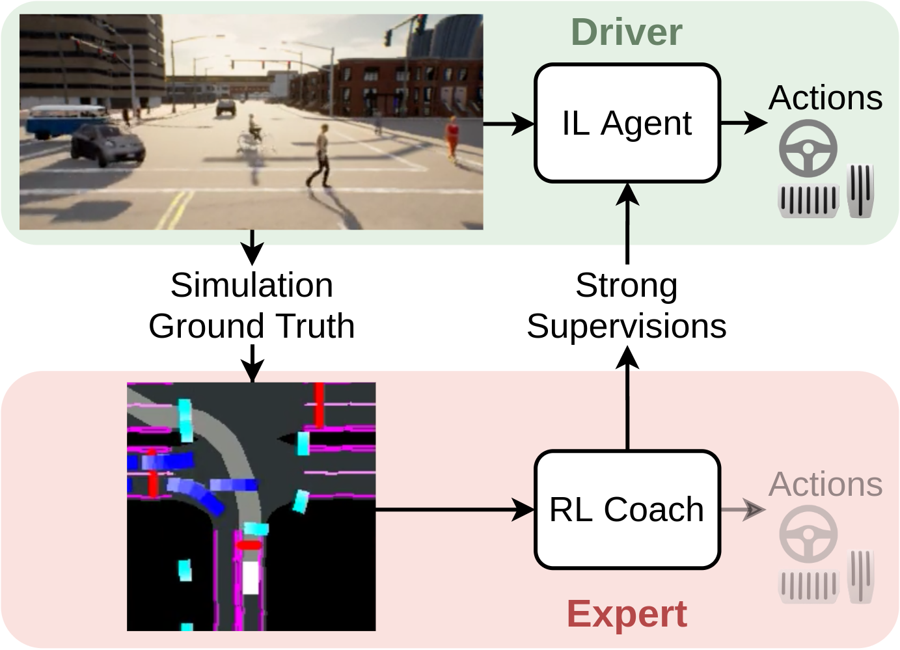
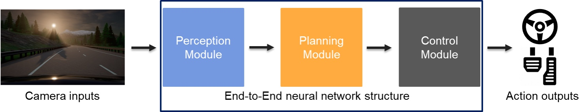
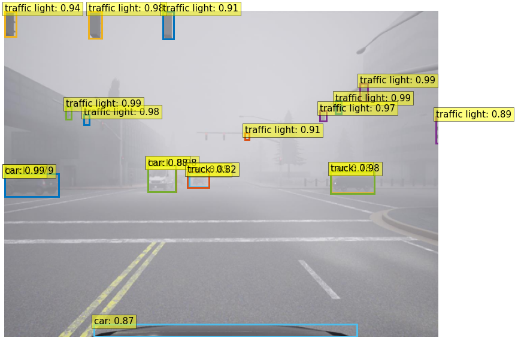

# Detrive: Imitation Learning with Transformer Detection for End-to-End Autonomous Driving

## Abstract

### On-policy training paradigm

The project is working in a simulator called [carla](https://carla.org/). To exploit the simulated driving enviroment, this project uses a cheated RL expert to train a IL agent. The RL expert can get access to a bird-eye-view (bev) map of the groud truth dynamic world. It is also provided with other necessary inputs like the current speed, and navigational command. The export is trained by a standard ppo algorithm in the carla [NoCrash](https://arxiv.org/abs/1904.08980) benchmark's training maps. This RL expert, compared to other experts, like human expert or a hand craft rule based expert, is not only saving human effort, but also providing a stronger on-policy supervision for the IL agent. The system overview is shown in the following figure. 

  

### IL model architechture

The IL model is an end-to-end neural network structure, which can be spilted into three major modules, perception, planning, and conrtol. The structure overview is shown in the following figure.

The perception module uses a [DETR-like](https://arxiv.org/abs/2005.12872) architecture to detect major traffic participants like cars, truck, pedestrians. In the percepyion module, the camera inputs are processed by a backbone net to extract features. Then, the feature map and a positional encoding are added together to be fed into a transformer encoder-decoder network to generate latent object detection code. The following figure shows the robustness of the perception module.

For planning, the perception outputs together with other sensors' inputs will then be fed into a mlp for dimensional transformation. Then a [105, 64] tensor feature will be the hidden layer of GRU cells, and a [105, 2] tensor of goal poit will be the input. The output of the planning module is k way points, where k depends on the number of GRU cells. 

The last module the control module, which is simply two PID controllers for generating longitudinal and lateral control, ie steer of [-1, 1] for left and right turn, velocity of [-1, 1] for the throttle and brack actions.

