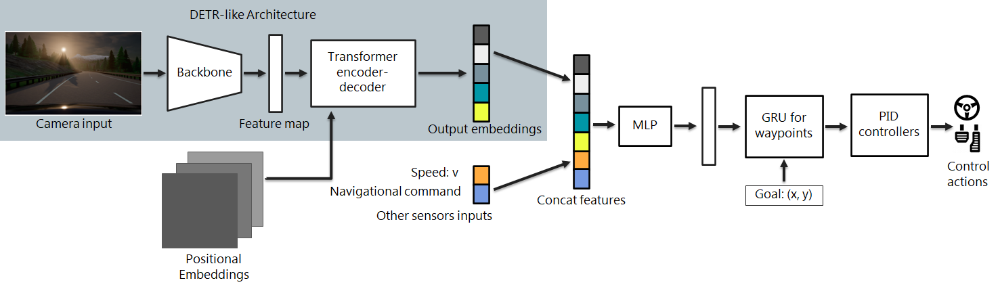
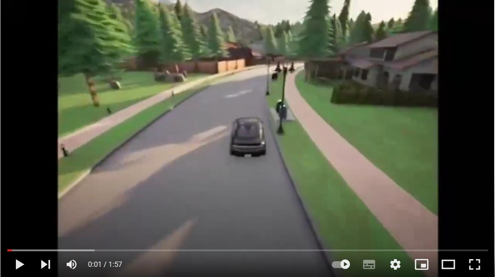
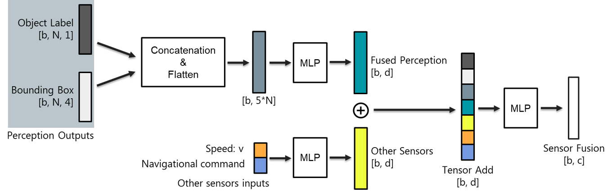
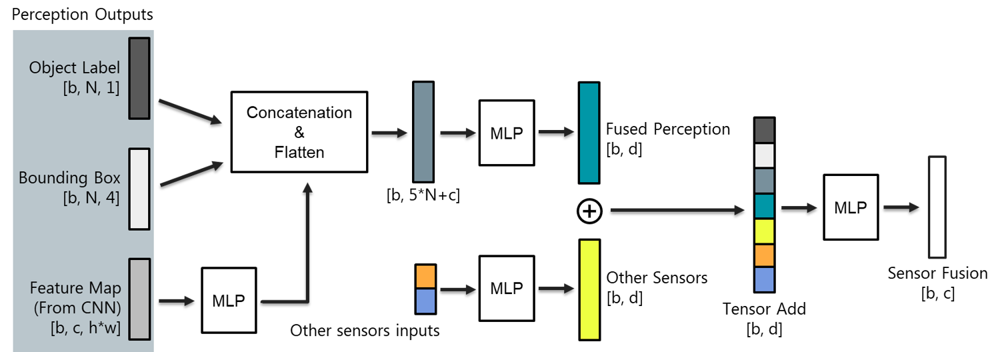
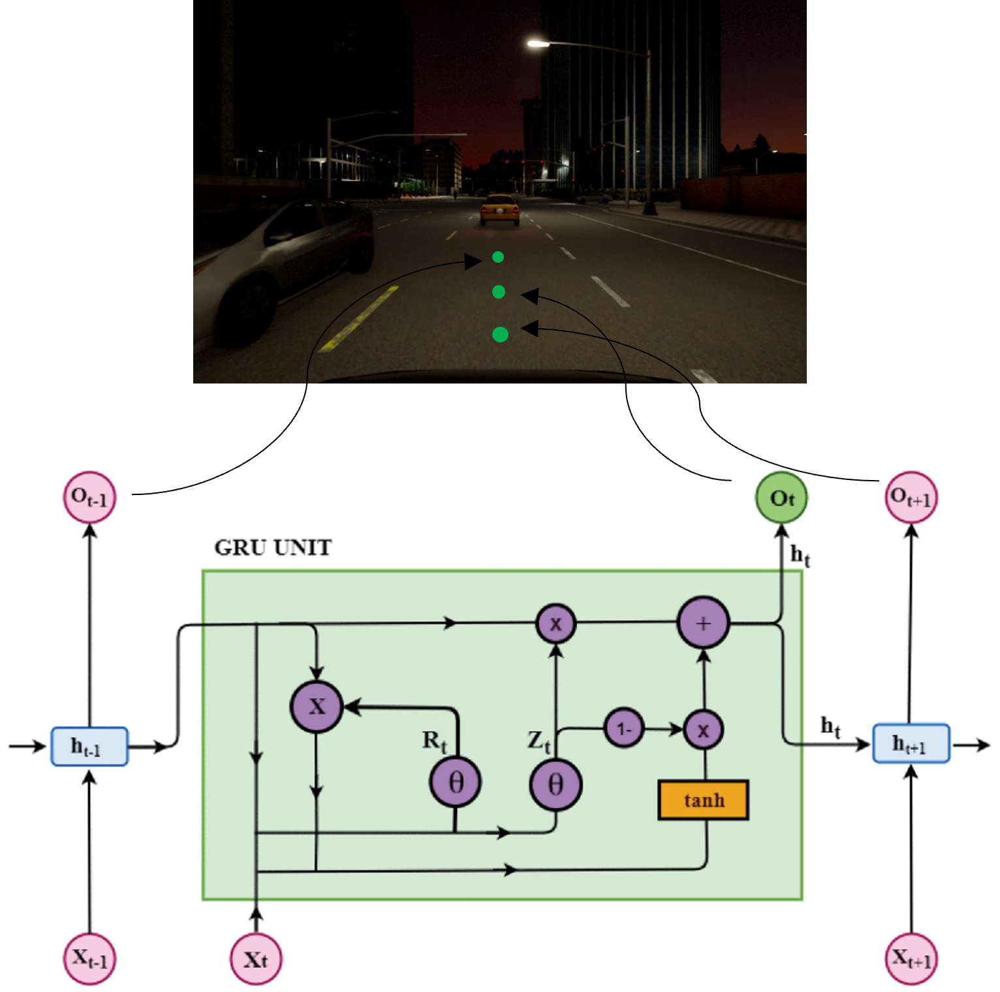

# Detrive

**Detrive: Imitation Learning with Transformer Detection for End-to-End Autonomous Driving** won the best paper award in the World Symposium on Digital Intelligence for Systems and Machines (DISA2023)

> [Arxiv link]((https://arxiv.org/abs/2310.14224)) for the paper



## Introduction

> Click the picture to play the video on youtube.

[](https://youtu.be/xl-nB0iC57k)

Detrive uses a [DETR](https://github.com/facebookresearch/detr) liked structure as its perception network to obtain the objects' label and bounding box. I designed two forms of feature fusion network for this model. They are Detrive-I and Detrive-II (or Detrive-res)

Detrive-I:
<p align="center">

</p>

Detrive-II:
<p align="center">

</p>


After feature fusion, a GRU-RNN is used to generate some way points for path planning.

<p align="center">

</p>

## Get Started

### Setup

Git clone this repo:
```
git clone https://github.com/Alexbeast-CN/Detrive.git
cd Detrive
conda env create -f environment.yml
```

Get your Carla 0.9.10.1 ready. 
```
mkdir carla
cd carla
wget https://carla-releases.s3.eu-west-3.amazonaws.com/Linux/CARLA_0.9.10.1.tar.gz
wget https://carla-releases.s3.eu-west-3.amazonaws.com/Linux/AdditionalMaps_0.9.10.1.tar.gz
tar -xf CARLA_0.9.10.1.tar.gz
tar -xf AdditionalMaps_0.9.10.1.tar.gz
rm CARLA_0.9.10.1.tar.gz
rm AdditionalMaps_0.9.10.1.tar.gz
cd ..
```

Get pre-trained models:

```
mkdir model_ckpt && cd model_ckpt
```

- For Detrive:
```
mkdir detrive && cd detrive
wget https://drive.google.com/file/d/1If662NkR6o5hoDGGyZEewcl2wKzMKym2/view?usp=sharing
```

- For Detrive-res:
```
mkdir detrive-res && cd detrive-res
wget https://drive.google.com/file/d/1pHGNiAjnbKKINZBW75mLMm_LD3LuLQ2y/view?usp=sharing
```

### Evaluation

Open the Carla server first by using:

```
<Path to carla>/CarlaUE4.sh -quality-level=Epic -world-port=2000 -resx=800 -resy=600 -opengl
```

Run the evaluation:

```
CUDA_VISIBLE_DEVICES=0 ./leaderboard/scripts/run_evaluation.sh
```

### Train

It's recommended to use [Roach](https://github.com/zhejz/carla-roach) to train the model. But other methods are also accepted. It's easy to use pre-collected dataset for trainning. A recommended dataset is the one provided by the [transfuser group](https://github.com/autonomousvision/transfuser/blob/cvpr2021/download_data.sh)

run download_data.sh

```
chmod +x download_data.sh
./download_data.sh
```

run the train.py

```
cd <to the path of the model>
python3 train.py
```

## Benchmark

|Model                 |Driving score|Route completion|Infraction penalty|Collisions pedestrians|Collisions vehicles|Collisions layout|Red light infractions|Stop sign infractions|Off-road infractions|Route deviations|Route timeouts|Agent blocked|
|----------------------|-------------|----------------|------------------|----------------------|-------------------|-----------------|---------------------|---------------------|--------------------|----------------|--------------|-------------|
|Detrive-II            |34.49        |67.37           |0.59              |0                     |0.32               |0.49             |0.78                 |0.15                 |0.45                |0               |0.03          |1.32         |
|Detrive-I             |15.17        |39.82           |0.47              |0                     |0.98               |2.93             |0.62                 |0.07                 |3.2                 |0               |0             |2.44         |
|LBC (CoRL 2019)       |8.94         |17.54           |0.73              |0                     |0.4                |1.16             |0.71                 |0                    |1.52                |0.03            |0             |4.69         |
|CILRS (ICCV 2019)     |5.37         |14.4            |0.55              |2.69                  |1.48               |2.35             |1.62                 |0                    |4.55                |4.14            |0             |4.28         |
|TransFuser (CVPR 2021)|16.93        |51.82           |0.42              |0.91                  |1.09               |0.19             |1.26                 |0                    |0.57                |0               |0.01          |1.96         |

## License

All code within this repository is under [Apache License 2.0](https://www.apache.org/licenses/LICENSE-2.0).
